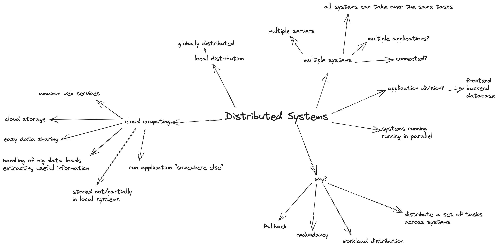

# hse-2023-winter

## Lab Requirements
Microservice project consisting of 3 Microservices:
- Frontend to visualise data and provide means to store data conviniently in contrast to via curl or postman
- Backend to process data
- Database to store data

The services can be in either technology
Ideally, containerized all 3 microservices.
Even more ideally, containerized via docker compose

Due Date: Exam Date (January 25th)

## 25. September 2023 - Lecture Canceled

## 02. October 2023 - Cloud Intro




### Important Slides

- Cloud Pyramid - IaaS, PaaS and SaaS
- Cloud Definition - "Service Model"
- Explain "cloud idea" with one cloud service of your choice

### Resource Capacities and Utilization
In traditional IT (buying and maintaining servers to run operations on) the resources have to be frequently upgraded with the growing workload of users.
This leads to chronical under-utilization of hardware with expensive purchase periods


## 09. October 2023 - Docker Intro

- [website For Exercises](https://hsed.new.trainings.nvtc.io/basics/)
- [Docker Hub](https://hub.docker.com/)
- [GitPod](https://www.gitpod.io/)

### NOTES REGARDING EXERCISES: 

We have decided to keep the website running throughout the entire semester so you can access and do the docker exercises at any point.

There is at some point a task that mentions connecting to a virtual machine via ssh.
You can skip this as we will be working either in gitpod or locally but wont have a VM provided to connect to.

2nd Note:
At the end of the containers chapter there is a command given in the exercises to stop all running containers:

```bash 
docker ps -a -q | xargs docker stop
```

Xargs is also a unix specific tool that we usually have within the VMs we provide but that you might not have access to.
So instead you can just stop the containers individually by first running 

```bash
docker ps -q
```

which will give you only the ids of all running containers

```bash
❯ docker ps -q
f90372eb09e3
e5596ca8439a
9771e7c99abb
```

look at the IDs and stop each individually by typing the first 3 digits of the ID

```bash
docker stop f90
```

or you can try ``` wargs ``` on windows though i cant confirm if this is working
```bash
docker ps -a -q | wargs docker rm
```

### Docker Image and Container Storage

Following Diagram illustrates how Image creation and layer sharing is handled and how multiple instances of the same image are created.


### Goal of the Lab Exercise


## 07.11.23 ADvanced Cloud Topics: Cap Theorem, 12 factor apps


## 20.11.23 Docker Advanced Topics:
### Volumes


### Docker Network


### Docker Compose
example docker compose that also creates network

```
version: '3'
services:
  my_service:
    image: my_image
    networks:
      - my_custom_network

networks:
  my_custom_network:
    driver: bridge

```
## 27.11.23 Kubernetes

### Drawbacks of Docker alone on multiple hosts


### Comparison to k8s


### The Kubeconfig


### Kubernetes rolling update


